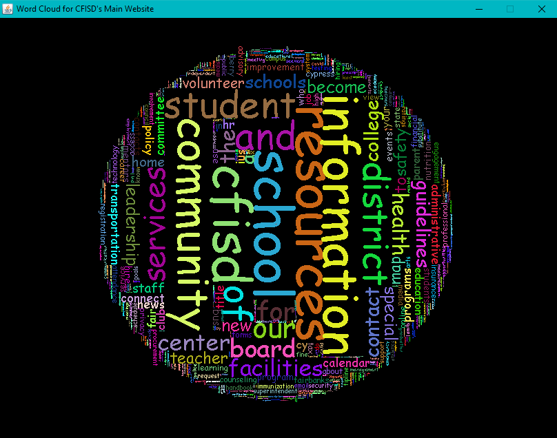
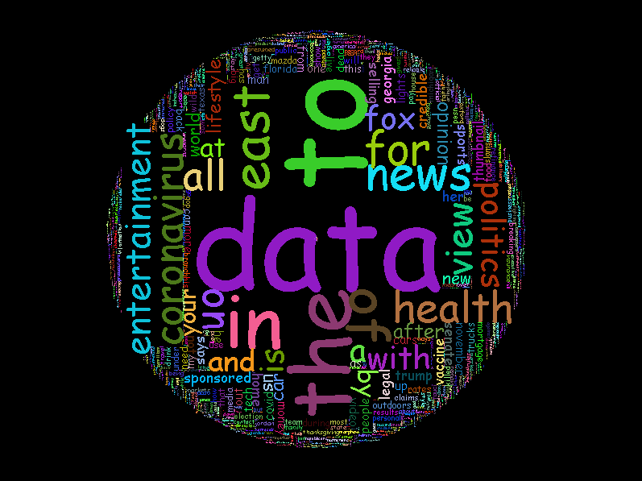
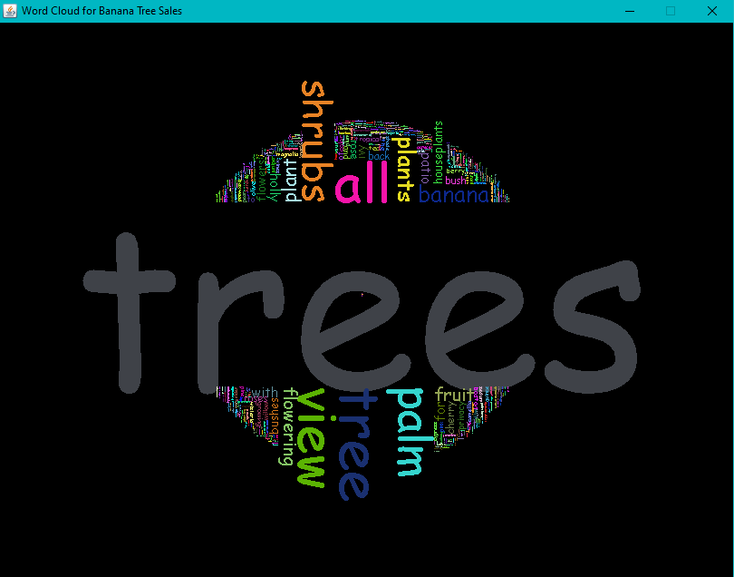

# Word Cloud
##### Created by Victor Nguyen & Roger Ye
* Scrapes a website and creates an image of a word cloud, where more frequent words will have a larger font size

## Examples of Images Created

Fig.1 - Cy-Fair ISD's Front Page

Fig.1 - Fox News

Fig.1 - Banana Tree Seller Website

\
Cy-Fair ISD's Front Page\
\
Fox News\
\
Banana Tree Seller Website
